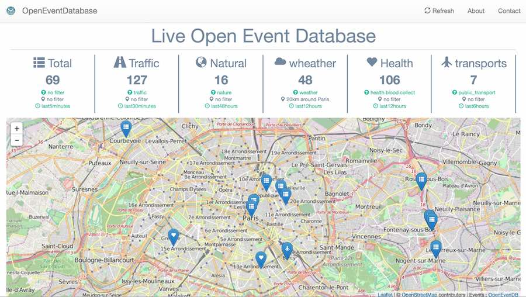

# OpenEventDatabase dashboard

Different kind of datas, way to filter... live

## Filters used

* All events, last 5 minutes
* Traffic, last 30 minutes
* Natural, last 48 hours
* Weather, last 12 hours, 20km around Paris
* Health, last 12 hours
* Transports, last 6 hours

## Components

* Based on dashboard template : gentella --> https://colorlib.com/polygon/gentelella/index.html
* Bootstrap
* JQuery
* Leaflet
* Plugins : Leaflet.Icon.Glyph.js

